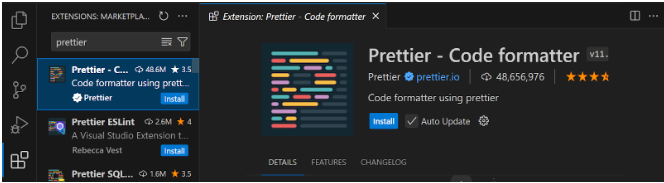
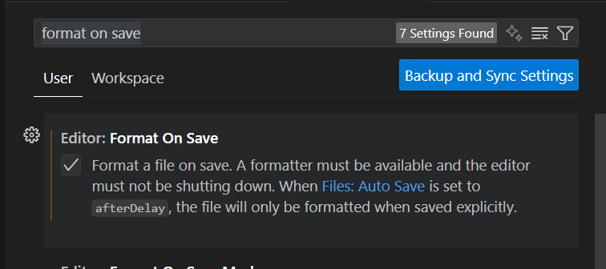
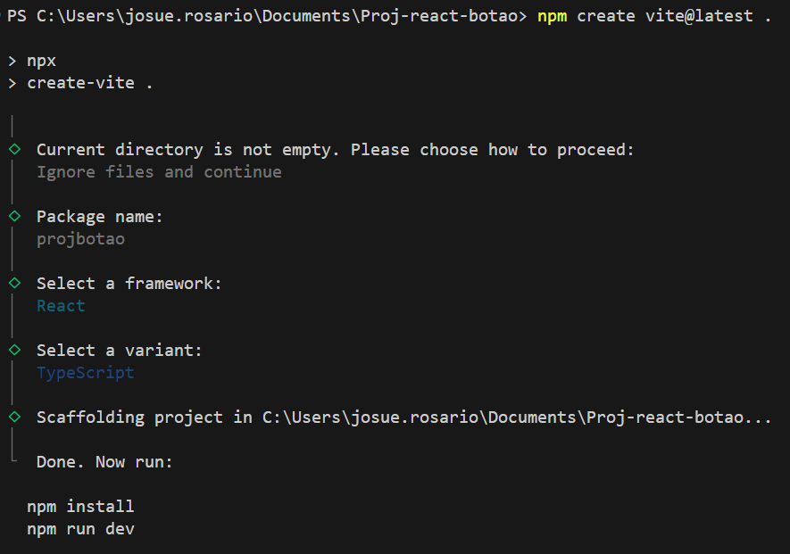
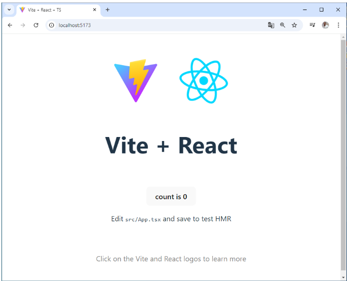

**versao do laboratório:** 1.0.0

**Data Criaçao:** 10/09/2025

# Descrição deste Laboratório

Fazer as configurações básicas do projeto

# Objetivos do Laboratório

Compreender :

- Criação de projeto usando vite
- Conceito de componentização
- Conceitos básicos de React
- Biblioteca Bootstrap
- Como configurar o bootstrap

# Links para estudo e consulta

**_Pagina Oficial do React_**

https://react.dev/

**_Iniciar o projeto com vite_**

https://pt.vitejs.dev/guide/

**_Bootstrap pagina oficial_**

https://getbootstrap.com/

# Links para estudo e consulta

# 1. Configurando o vscode

Instalar a extensão Prettier Code Formatter

1. Na parte esquerda selecione extensões
2. Busque a extensão Prettier Code Formatter
3. Clique no botão install e autorize



4. Pressione CTRL e virgula
5. Pesquisar por format on save e marcar a opção
   

# 2. Configurando o projeto com o vite

Rodar o comando abaixo, no terminal, para criar os arquivs do projeto

`npm create vite@latest .`

| Configure    | com o seguinte dado |
| ------------ | ------------------- |
| Package Name | projbotao           |
| Framework    | React               |
| variant      | TypeScript          |

Exemplo de saida



caminho\do\arquivo.ext

Rode o comando para instalar a dependencias

`npm i`

obs: Verifique se a pasta node_modules foi criada

Rode o projeto e acesse o link (CTRL clicando)

`npm run dev`



# 3. Configurando o Bootstrap no projeto

Instalar a dependencia

`npm i bootstrap@latest`

Importar o bootstrap no projeto

src/main.tsx

```javascript
import { StrictMode } from "react";
import { createRoot } from "react-dom/client";
import "./index.css";
import App from "./App.tsx";
import "bootstrap/dist/css/bootstrap.css"; //linha adicionada
```

# Alterações Executadas

| Data       | Responsável   | Descrição           |
| ---------- | ------------- | ------------------- |
| 10/09/2025 | Josué Rosario | Criação do Tutorial |
